# 🚗 OficinaPro | Sistema de Gerenciamento Mecânico

<div align="center">
  
  
  <br>
  
  <p><b>Sistema Completo de Gerenciamento Mecânico e Fluxo de OS</b></p>
</div>

<br>


> **Projeto desenvolvido para a AV2 da disciplina de Backend.**

O **OficinaPro** é uma aplicação CRUD completa e escalável projetada para o gerenciamento de ponta a ponta de uma oficina mecânica. O sistema moderniza o fluxo de trabalho, permitindo o controle preciso de clientes, frota de veículos, equipe técnica, estoque de peças/serviços e faturamento através de Ordens de Serviço (OS).

---

## 🚀 Como Configurar e Executar o Projeto

### 1. Clonar o Repositório

```bash
git clone https://github.com/emilainezx/crud-oficina-mecanica.git
cd crud-oficina-mecanica
```

### 2. Configurar e Rodar o Back-end (API)

Abra o terminal, entre na pasta do backend e instale as dependências:

```bash
cd backend
npm install
```

### 3. Criar o Arquivo `.env`

Dentro da pasta **backend**, renomeie o arquivo **.env.example** para **.env**:

```bash
cp .env.example .env
```

Em seguida, abra o arquivo `.env` e substitua o conteúdo pelas credenciais abaixo — o banco já está configurado e compartilhado, não é necessário criar uma conta no Supabase:

```env
DB_USER=postgres.hxbpvxtqkyoqbmrmjxol
DB_PASSWORD=AnvrS5AjfjJNmlcl
DB_NAME=postgres
DB_HOST=aws-1-sa-east-1.pooler.supabase.com
DB_PORT=5432
DB_DIALECT=postgres

SUPABASE_URL=https://hxbpvxtqkyoqbmrmjxol.supabase.co
SUPABASE_KEY=sb_publishable_pCklj4RndZyWVtdhUDI3KA_S-fEVrZF
```

### 4. Criar as tabelas e ligar a API

Ainda no terminal da pasta **backend**, rode os comandos a seguir:

```bash
npm install postgres
npx sequelize-cli db:migrate
npm run dev
```

### 5. Configurar e Rodar o Frontend (Visual)

Abra um **NOVO** terminal (não feche o terminal **backend**) e entre na pasta **frontend**:

```bash
cd frontend
npm install
npm run dev
```

O sistema estará disponível em:

```
http://localhost:5173
```

### 6. Popular o Banco de Dados Automaticamente (Seed)

Para facilitar os testes, criamos um script automatizado (`popularBanco.js`). Ele limpa o banco de dados de forma segura e injeta um cenário real e completo, contendo mecânicos, clientes, frota de veículos, estoque de peças e diversas Ordens de Serviço em diferentes status (para testar o fluxo do Dashboard).

> ⚠️ **Atenção:** este script apaga todos os dados existentes e insere novos. Use apenas para testes.

```bash
cd backend
node popularBanco.js
```

---

## 🖼️ Demonstração do Sistema

| Funcionalidade | Print da Interface | Dados no Supabase |
| :--- | :---: | :---: |
| **Dashboard** | 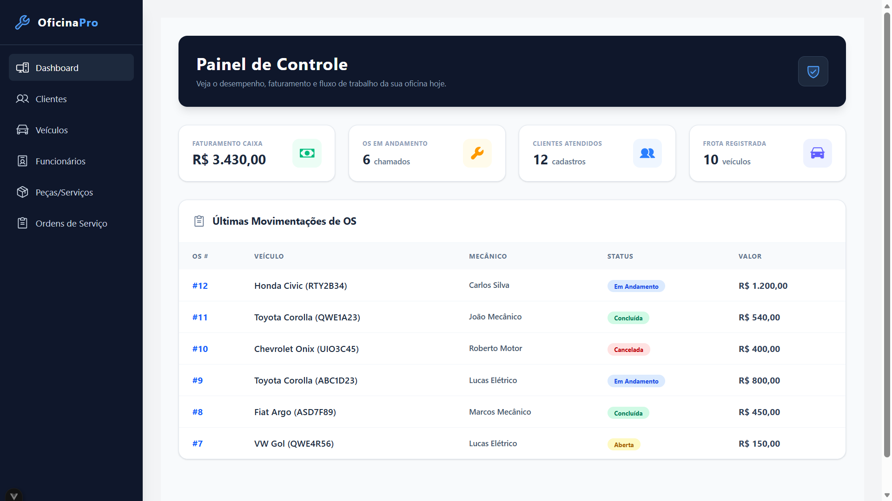 | |
| **Clientes** | 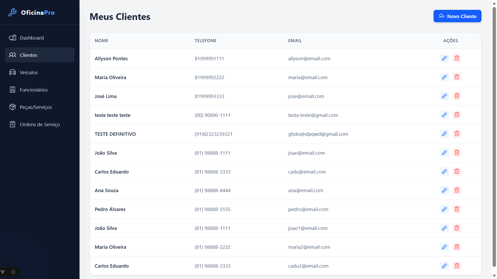 | 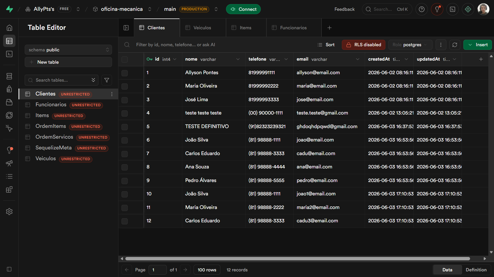 |
| **Veículos** | 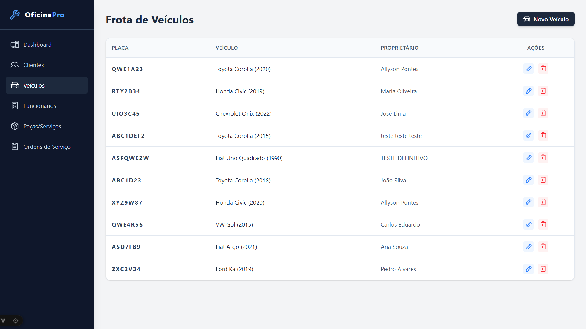 | 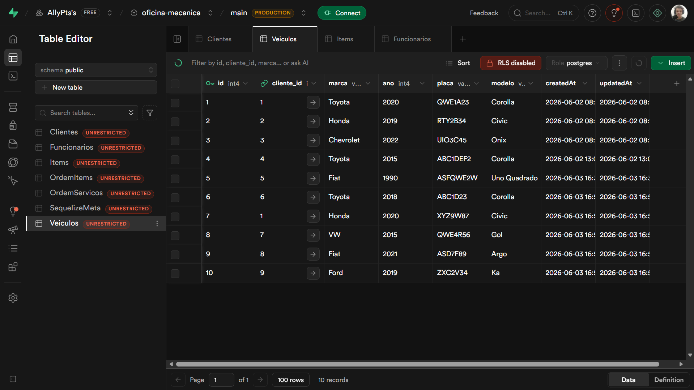 |
| **Funcionários** | 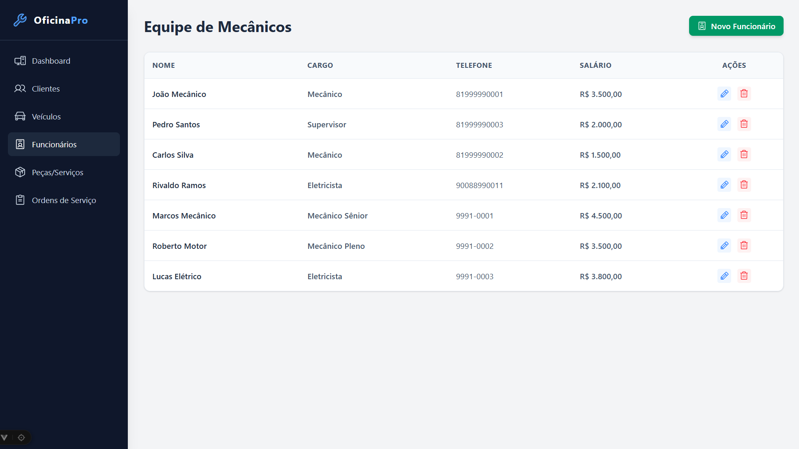 | 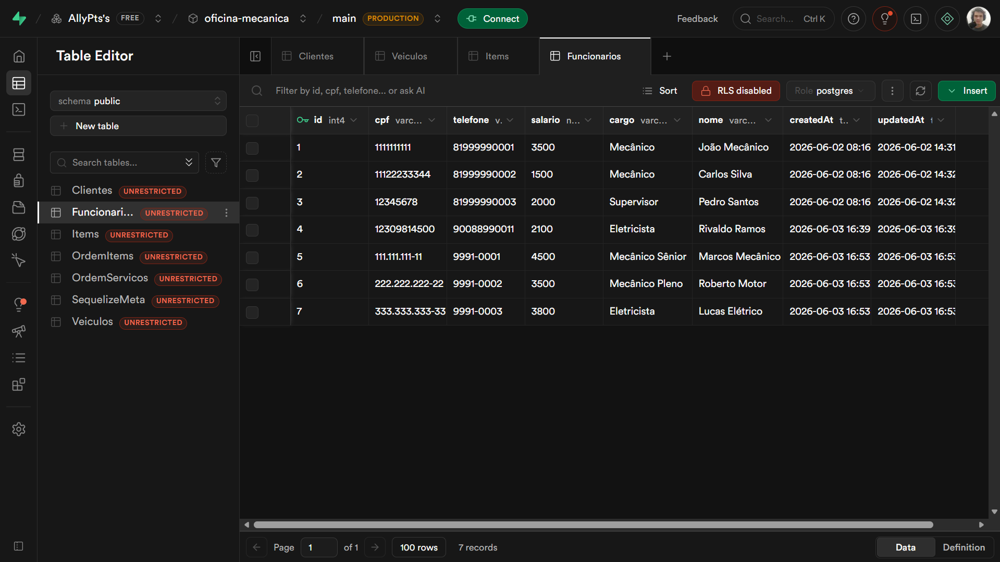 |
| **Peças/Serviços** | 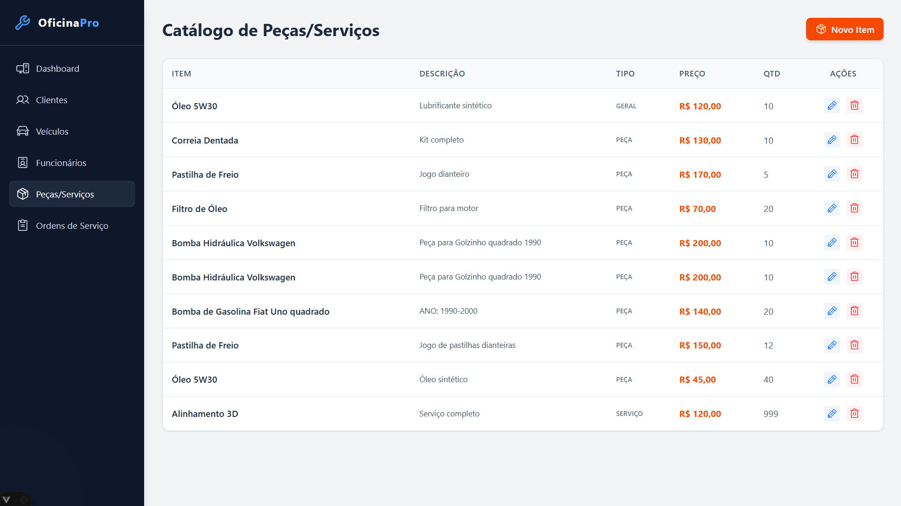 | 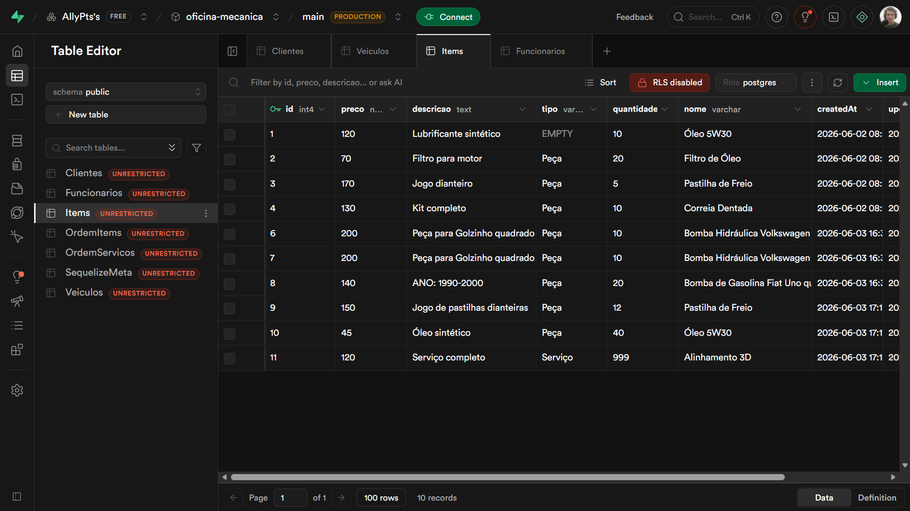 |
| **Ordens de Serviço** | 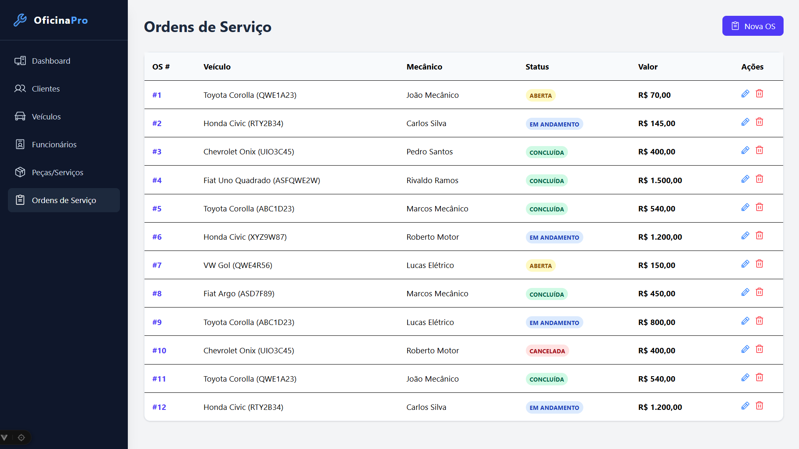 | 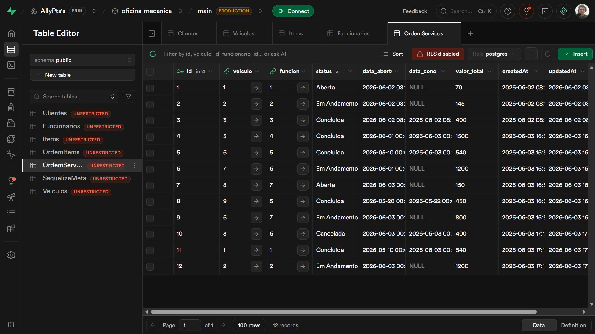 |

---

## ✨ Funcionalidades

- 👥 **Gestão de Clientes:** Cadastro e controle de proprietários.
- 🚗 **Frota de Veículos:** Registro detalhado de veículos vinculados aos clientes.
- 🛠️ **Equipe Técnica:** Gerenciamento de mecânicos e funcionários.
- ⚙️ **Catálogo de Estoque:** Controle de peças e serviços oferecidos.
- 📋 **Ordens de Serviço (OS):** Abertura, acompanhamento de status (Aberta, Em Andamento, Concluída, Cancelada) e faturamento de serviços vinculando veículos, mecânicos e itens.
- 🔌 **Integração Full-Stack:** API RESTful robusta no back-end alimentando um dashboard interativo no front-end construído em Vue 3.

---

## 🚀 Tecnologias Utilizadas

O projeto foi desenvolvido em arquitetura Full-Stack (Monorepo), garantindo isolamento entre o Servidor (Backend) e a Interface (Frontend):

### 💻 Front-end (Interface)


* **[Vue 3 (Composition API)](https://vuejs.org/):** Framework JavaScript progressivo para construção da interface de usuário reativa.
* **[Vite](https://vitejs.dev/):** Build tool ultra-rápido.
* **[Tailwind CSS](https://tailwindcss.com/):** Framework CSS utilitário para estilização rápida e responsiva.
* **[Vue Router](https://router.vuejs.org/):** Gerenciamento de rotas (Single Page Application).
* **[Axios](https://axios-http.com/):** Cliente HTTP para comunicação com a API.
* **[Phosphor Icons](https://phosphoricons.com/):** Biblioteca de ícones vetoriais elegantes.

### ⚙️ Back-end (API REST)


* **[Node.js](https://nodejs.org/) & [Express.js](https://expressjs.com/):** Ambiente e framework para criação do servidor e rotas HTTP.
* **[Sequelize](https://sequelize.org/):** ORM poderoso para modelagem de dados, migrations e queries sem escrever SQL puro.
* **[Cors](https://expressjs.com/en/resources/middleware/cors.html):** Segurança e permissão de comunicação entre Front e Back.

### 🗄️ Banco de Dados e Infraestrutura


* **[PostgreSQL](https://www.postgresql.org/):** Banco de dados relacional que garante a integridade das tabelas.
* **[Supabase](https://supabase.com/):** Plataforma (BaaS) hospedando o Postgres na nuvem.

---

## 👨‍💻 Integrantes do Projeto

Este software foi projetado e desenvolvido pelo time:

- Allyson Allan Martins Pontes — Matrícula: 01854829  
- Emilaine Bernardo da Silva — Matrícula: 01763693  
- Marcelo Travassos Lima de Souza — Matrícula: 01818937  

---

## 📂 Estrutura do Projeto

```text
📦 CRUD-OFICINA-MECANICA/
├── 📂 backend/                  # Servidor, Regras de Negócio e Banco de Dados (API)
│   ├── 📂 src/
│   │   ├── controllers/         # Lógica das rotas (Criar, Listar, Atualizar, Deletar)
│   │   ├── database/            # Configuração e Migrations do Sequelize
│   │   ├── models/              # Estrutura das tabelas no banco de dados
│   │   ├── routes.js            # Endpoints da API REST
│   │   └── server.js            # Inicializador da porta 3333
│   ├── .env                     # Credenciais do Supabase (NÃO ENVIADO AO GITHUB)
│   ├── .env.example             # Exemplo de variáveis necessárias
│   ├── .sequelizerc             # Caminhos do ORM
│   └── package.json             # Dependências Node.js do Backend
│
├── 📂 frontend/                 # Interface do Usuário (Vue + Vite)
│   ├── 📂 public/               # Favicon e assets estáticos
│   ├── 📂 src/
│   │   ├── router/              # Configuração das rotas das páginas
│   │   ├── services/            # Configuração do Axios (api.js)
│   │   ├── views/               # Telas principais (Dashboard, Clientes, etc.)
│   │   ├── App.vue              # Componente raiz e Sidebar
│   │   ├── main.js              # Ponto de entrada do Vue
│   │   └── style.css            # Importações do Tailwind CSS
│   ├── .gitignore               # Arquivos ignorados pelo Git no front
│   ├── index.html               # Base do site
│   ├── package.json             # Dependências Vue.js do Frontend
│   └── vite.config.js           # Compilador
│
├── .gitignore                   # Ignora pastas de bibliotecas (node_modules) na raiz
└── README.md                    # Esta documentação que você está lendo
```